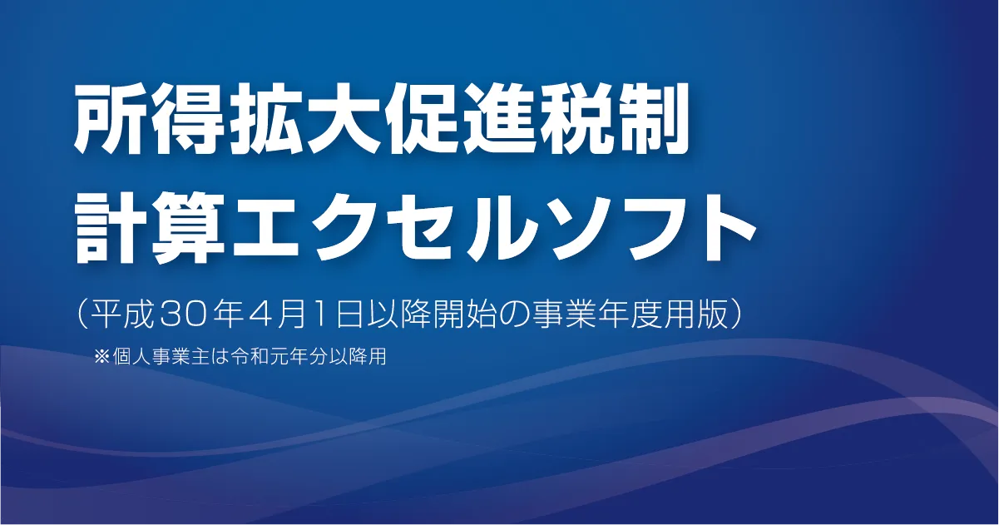

<h3 align="left">Languages and Tools</h3>

<h3 align="left">Products</h3>

- [**KAWAICHI Portfolio**](https://kawaichi0228.com/)

  

  - Storybook: https://ui.kawaichi0228.com
  - Technical Stack: https://kawaichi0228.com/product/portfolio
    - React,TypeScript,SCSS,emotion,Atomic Design,Storybook,AWS(API Gateway,Lambda,SSM etc.),Terraform,Illustrator,SendGrid,reCAPTCHA(v3),GoogleAnalytics(GA4) ...

- [**かわいちのエンジニアぶろぐ！**](https://kawaichiblog.com/)

  
  
  - Technical Stack: https://kawaichi0228.com/product/kawaichiblog
    - Next.js,TypeScript,SCSS,TailwindCSS,GraphQL,Jamstack,microCMS,AWS(Amplify,AppSync,Lambda,DynamoDB,EventBridge etc.),Terraform,Illustrator,SendGrid,reCAPTCHA(v3),GoogleTagManager,GoogleAnalytics(GA4) ...

- [**トークストック**](https://www.talkstock.jp/) ***close**
  
  

  - Technical Stack: https://kawaichi0228.com/product/talkstock
    - Next.js,TypeScript,MUI,bulletproof-react,Echo(Golang),REST API,OpenAI API(Chat Completions API),AWS(Cognito,ECS Fargate,Aurora RDS,S3,CloudFront,Lambda@Edge,Route53,ACM etc.),Docker,Terraform,GitHub Actions,Illustrator,SendGrid,GoogleTagManager,GoogleAnalytics(GA4) ...
  
- [**FitScreenWindow(OSS)**](https://fitscreenwindow.com/)

  

  - GitHub: https://github.com/Kawaichi0228/FitScreenWindow/
  - Technical Stack: https://kawaichi0228.com/product/fitscreenwindow
    - Python3,Qt,Qt Creator,NSIS,venv,Vue.js,SCSS,BEM,Illustrator,GitHub Pages ...
  - LT(2022/05): https://www.docswell.com/s/Kawaichi0228/51JE1L-2023-12-03-222909

- [**所得拡大促進税制エクセルソフト**](https://github.com/Kawaichi0228/shotokukakudaiexcel-main/) ***close**

  
  
  - Style guides: https://github.com/Kawaichi0228/shotokukakudaiexcel-main/blob/master/styleguide/README.md
  - Technical Stack: https://kawaichi0228.com/product/shotoku
    - Excel VBA,MySQL,Illustrator

<h3 align="left">Blog</h3>
https://kawaichiblog.com

<h3 align="left">Design</h3>
https://kawaichi0228.com/design

<h3 align="left">Drums</h3>
https://drums.kawaichi0228.com

<h3 align="left">Blog Articles Ranked #1 on Google</h3>

- "vscode 型 表示" (2024/5)
  
  [【TypeScript】型を調べる方法「VSCodeのホバー表示」](https://kawaichiblog.com/blog/yr2wzlvn2)

- "vscode 予測変換 オフ" (2025/4)
  
  [【VSCode】インテリセンスの自動表示をオフにする【予測変換・コード補完・サジェスト】](https://kawaichiblog.com/blog/auto-intellisense-off)

- "chrome ショートカット 翻訳 切り替え" (2024/8)
  
  [【Chrome】ショートカットで日本語と英語原文の翻訳を切り替え【BetterTouchTool】](https://kawaichiblog.com/blog/btt-translated-into-japanese)

- "vscode react import 自動" (2025/1)
  
  [【React×VSCode】自動でimport＆未使用importの削除とソートで爆速開発！](https://www.kawaichiblog.com/blog/ej-gewz8edl8)
